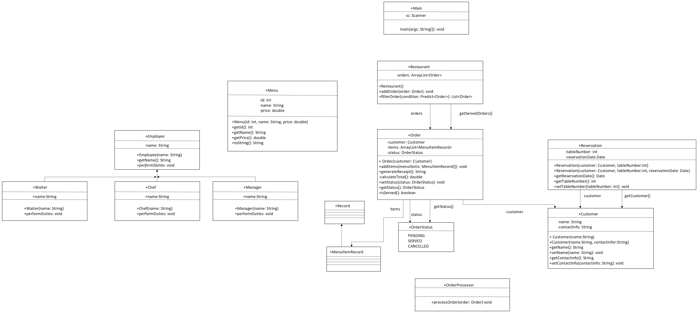

### README: Restaurant Application

---

#### **Overview**
The Restaurant Application is a menu-driven system designed for users to browse a food menu, select items, view details, and place orders. This application can be extended to manage inventory, staff, and financial transactions in a real-world scenario.
---

#### **Features**
1. **Menu Display**: Shows a list of food items with their names, IDs, and prices.
2. **Item Selection**: Allows users to select menu items by ID.
3. **Order Management**: Confirms user selections and displays a summary of chosen items.
4. **Error Handling**: Guides users to re-enter IDs or correct inputs if invalid data is provided.
---

#### **Technologies Used**
- **Programming Language**: Java v22
---

#### **UML Image**
To include images in a Java application:

---

#### **Future Enhancements**
- Staff and inventory management modules.
- Analytics and reporting for restaurant performance.
--- 
